# Memex CLI 启动流程分析

## 流程图

```mermaid
flowchart TD
    Start([应用启动]) --> Main[main 函数]
    Main --> RealMain[real_main 函数]
    
    RealMain --> ParseArgs[解析命令行参数<br/>clap::Parser]
    ParseArgs --> LoadConfig[加载配置<br/>load_default]
    LoadConfig --> InitTracing[初始化日志<br/>init_tracing]
    
    InitTracing --> CheckState{检查状态管理<br/>是否启用?}
    CheckState -->|是| CreateStateManager[创建 StateManager<br/>订阅状态事件]
    CheckState -->|否| CreateContext
    CreateStateManager --> CreateContext[创建 AppContext<br/>配置+状态管理器+事件输出]
    
    CreateContext --> HasCommand{是否有子命令?}
    
    HasCommand -->|Run| DispatchRun[dispatch Run]
    HasCommand -->|Replay| DispatchReplay[dispatch Replay]
    HasCommand -->|Resume| DispatchResume[dispatch Resume]
    HasCommand -->|无| RunApp[run_app_with_config]
    
    DispatchRun --> RunApp
    DispatchReplay --> ReplayCmd[replay::replay_cmd]
    DispatchResume --> ResumeApp[run_app_with_config<br/>with recover_run_id]
    
    RunApp --> ParseRunArgs[解析 RunArgs<br/>提取配置参数]
    ParseRunArgs --> OverrideConfig[覆盖配置<br/>project_id, memory_url, etc]
    OverrideConfig --> CheckTuiForce{强制 TUI?<br/>--tui flag}
    
    CheckTuiForce -->|是| EnableStream[启用流模式<br/>format=text]
    CheckTuiForce -->|否| CheckStream[检查流配置]
    EnableStream --> BuildStream
    CheckStream --> BuildStream[构建流插件<br/>factory::build_stream]
    
    BuildStream --> DetermineTui{确定是否使用 TUI}
    DetermineTui --> TuiCheck1{force_tui?}
    TuiCheck1 -->|否| TuiCheck2{cfg.tui.enabled?}
    TuiCheck2 -->|否| UseTui[should_use_tui=false]
    TuiCheck2 -->|是| TuiSupport{check_tui_support}
    TuiSupport -->|支持| UseTui2[should_use_tui=true]
    TuiSupport -->|不支持| UseTui
    TuiCheck1 -->|是| TuiSupport
    
    UseTui2 --> BuildPlugins
    UseTui --> BuildPlugins[构建插件<br/>memory/policy/gatekeeper]
    
    BuildPlugins --> GenerateRunId[生成或恢复 run_id<br/>UUID]
    GenerateRunId --> FlowDecision{选择流程}
    
    FlowDecision -->|TUI| TuiFlow[run_tui_flow]
    FlowDecision -->|Standard| StandardFlow[run_standard_flow]
    
    TuiFlow --> SetupTui[创建 TuiRuntime<br/>setup_terminal]
    SetupTui --> PromptInput[prompt_for_input<br/>在 TUI 中获取用户输入]
    PromptInput --> SetPendingQA[设置 pending_qa=true<br/>qa_started_at=now]
    SetPendingQA --> RenderOnce[渲染一次 TUI<br/>显示待处理状态]
    RenderOnce --> RunWithQuery[run_with_query<br/>tui_ptr]
    
    StandardFlow --> ResolveQuery[resolve_user_query<br/>从参数/文件/stdin]
    ResolveQuery --> RunWithQuery2[run_with_query<br/>tui_ptr=None]
    
    RunWithQuery --> CreateSession[创建状态会话<br/>StateManager.create_session]
    RunWithQuery2 --> CreateSession
    
    CreateSession --> InitPhase[转换到 Initializing 阶段]
    InitPhase --> LoadGkConfig[加载 Gatekeeper 逻辑配置]
    LoadGkConfig --> LoadInjectConfig[加载提示注入配置]
    LoadInjectConfig --> LoadCandConfig[加载候选提取配置]
    
    LoadCandConfig --> QaPre[qa_pre_run<br/>执行预运行查询]
    QaPre --> MemorySearch[内存搜索<br/>memory.search]
    MemorySearch --> GatekeeperEval[Gatekeeper 评估]
    GatekeeperEval --> MergePrompt[合并提示<br/>注入内存上下文]
    
    MergePrompt --> ClearPendingQA{TUI 模式?}
    ClearPendingQA -->|是| UpdateTuiState[更新 TUI 状态<br/>pending_qa=false]
    ClearPendingQA -->|否| InferTask
    UpdateTuiState --> InferTask[推断任务级别<br/>L0-L3]
    
    InferTask --> CreateBackend[创建后端会话<br/>codecli/aiservice]
    CreateBackend --> BuildSession[构建 RunnerSession]
    
    BuildSession --> TuiMode{TUI 模式?}
    TuiMode -->|是| RunTuiSession[run_tui_session<br/>with TUI event loop]
    TuiMode -->|否| RunSession[run_session<br/>standard]
    
    RunTuiSession --> StateSubscribe[订阅状态事件<br/>StateManager.subscribe]
    StateSubscribe --> SpawnStateTask[启动状态监听任务<br/>转发到 TUI]
    SpawnStateTask --> SpawnRunTask[启动运行任务<br/>run_session]
    SpawnRunTask --> TuiEventLoop[TUI 事件循环<br/>run_with_tui_on_terminal]
    
    TuiEventLoop --> SelectLoop{tokio::select!}
    SelectLoop --> EventRx[event_rx: 处理 TUI 事件]
    SelectLoop --> InputRx[input_rx: 处理键盘输入]
    SelectLoop --> RunTaskRes[run_task: 等待运行完成]
    SelectLoop --> Tick[tick: 定期刷新]
    
    EventRx --> UpdateApp[更新 TuiApp 状态]
    InputRx --> HandleKey[处理按键<br/>可能退出]
    RunTaskRes --> CheckResult[检查运行结果]
    Tick --> HideSplash[可能隐藏启动画面]
    
    UpdateApp --> DrawTerminal[terminal.draw<br/>渲染 UI]
    HandleKey --> DrawTerminal
    CheckResult --> DrawTerminal
    HideSplash --> DrawTerminal
    
    DrawTerminal --> CheckDone{is_done 或<br/>exit_requested?}
    CheckDone -->|否| SelectLoop
    CheckDone -->|是| StopReader[停止输入读取器]
    
    StopReader --> RestoreTui[恢复终端<br/>restore_terminal]
    RestoreTui --> ReturnResult[返回 RunnerResult]
    
    RunSession --> DirectRun[直接运行会话<br/>无 TUI]
    DirectRun --> SessionResult[返回 SessionResult]
    
    ReturnResult --> ExitCode[提取退出码]
    SessionResult --> ExitCode
    
    ExitCode --> End([退出应用])
    
    style Start fill:#90EE90
    style End fill:#FFB6C1
    style TuiFlow fill:#87CEEB
    style StandardFlow fill:#DDA0DD
    style TuiEventLoop fill:#FFD700
    style RunSession fill:#FFA07A
```



## 关键组件说明

### 1. 入口点 (main.rs)
- **main()**: Tokio async 运行时入口
- **real_main()**: 实际主逻辑
  - 解析命令行参数 (clap)
  - 加载配置文件 (config.toml)
  - 初始化日志系统
  - 创建状态管理器 (可选)
  - 创建应用上下文 (AppContext)

### 2. 配置加载 (config/load.rs)
- 配置优先级:
  1. 环境变量 (最高)
  2. ~/.memex/config.toml
  3. ./config.toml
  4. 默认配置 (最低)
- 自动创建必要目录:
  - ~/.memex/events_out
  - ~/.memex/logs

### 3. 命令分发 (main.rs::dispatch)
- **Run**: 运行新会话
- **Replay**: 重放事件
- **Resume**: 恢复会话

### 4. 应用上下文 (AppContext)
包含:
- AppConfig: 应用配置
- StateManager: 状态管理器 (可选)
- EventsOutTx: 事件输出通道

### 5. 流程选择 (app.rs::run_app_with_config)
根据配置和参数决定使用:
- **TUI 流程** (flow_tui.rs): 交互式终端 UI
- **标准流程** (flow_standard.rs): 命令行模式

#### TUI 启用条件:
1. `--tui` 参数强制启用，或
2. `cfg.tui.enabled = true`，且
3. `check_tui_support()` 通过 (检查终端能力)

### 6. TUI 流程 (flow_tui.rs)

#### 初始化阶段:
1. 创建 TuiRuntime (terminal + TuiApp)
2. 设置终端 (setup_terminal)
3. 进入原始模式，启用鼠标支持

#### 输入阶段:
1. **prompt_for_input**: 在 TUI 中显示输入框
2. 用户输入查询文本
3. 设置 `pending_qa = true`
4. **立即渲染一次** - 显示"正在处理"状态 ✅ (已修复)

#### 运行阶段:
1. 调用 `run_with_query` (共享逻辑)
2. 执行内存搜索和 Gatekeeper 评估
3. 调用 `run_tui_session`:
   - 创建 TUI 事件通道 (tui_tx/tui_rx)
   - 订阅状态管理器事件
   - 启动状态监听任务
   - 启动运行任务 (run_session)
   - 进入 TUI 事件循环

#### TUI 事件循环:
```rust
tokio::select! {
    Some(event) = event_rx.recv() => {
        // 处理 TUI 事件 (ToolEvent, AssistantOutput, etc)
        app.handle_event(event);
    }
    Some(key) = input_rx.recv() => {
        // 处理键盘输入
        if app.handle_key(key) { exit_requested = true; }
    }
    res = &mut run_task => {
        // 运行任务完成
        run_result = Some(res);
    }
    _ = tick.tick() => {
        // 定期刷新 (16-100ms)
    }
}

// 每次循环后渲染 UI
terminal.draw(|f| ui::draw(f, app))?;
```

### 7. 标准流程 (flow_standard.rs)
1. 解析用户查询 (prompt/prompt_file/stdin/args)
2. 调用 `run_with_query`
3. 直接执行 `run_session` (无 TUI)
4. 等待完成并返回退出码

### 8. 查询处理 (flow_qa.rs::run_with_query)
共享逻辑，用于 TUI 和标准流程:

1. **状态管理初始化**:
   - 创建会话 (session_id)
   - 转换到 Initializing 阶段

2. **配置加载**:
   - Gatekeeper 逻辑配置
   - 提示注入配置
   - 候选提取配置

3. **预运行查询** (qa_pre_run):
   - 内存搜索 (memory.search)
   - Gatekeeper 评估
   - 合并提示 (注入内存上下文)
   - 生成 wrapper events

4. **任务级别推断**:
   - Auto: 基于启发式规则
   - L0-L3: 显式指定

5. **后端会话创建**:
   - codecli: 本地二进制
   - aiservice: HTTP 服务

6. **会话执行**:
   - 调用传入的 `run_session_fn`
   - TUI: run_tui_session
   - Standard: run_session

### 9. 状态管理 (StateManager)
发布事件:
- SessionCreated
- SessionStateChanged (RuntimePhase)
- ToolEventReceived
- MemoryHit
- SessionCompleted
- SessionFailed

订阅者:
- main.rs: 日志记录
- TUI: 状态显示更新

### 10. 插件系统 (plugins/factory)
- **Memory**: 内存搜索和存储
- **Policy**: 策略控制
- **Gatekeeper**: 安全检查和决策
- **Stream**: 输出流处理
- **Runner**: 后端执行器

## 数据流

```
用户输入 (CLI/TUI)
  ↓
配置 (TOML + ENV)
  ↓
插件工厂 (factory::build_*)
  ↓
会话创建 (RunnerSession)
  ↓
内存搜索 (MemoryPlugin)
  ↓
Gatekeeper 评估
  ↓
后端执行 (codecli/aiservice)
  ↓
事件流 (TuiEvent/ToolEvent)
  ↓
状态更新 (StateManager)
  ↓
输出 (TUI/stdout + events_out)
```

## 关键修复

### 问题: TUI 没有渲染
**原因**: 在 [flow_tui.rs](cli/src/flow/flow_tui.rs#L68-L71) 中，设置 `pending_qa = true` 后没有立即渲染。

**修复**:
```rust
// 设置待处理状态后立即渲染一次
if let Err(e) = tui.terminal.draw(|f| crate::tui::ui::draw(f, &mut tui.app)) {
    tui.restore();
    return Err(RunnerError::Spawn(format!("failed to render TUI: {}", e)));
}
```

**效果**: 用户提交输入后立即看到"正在处理查询"的状态提示。

## 执行路径示例

### TUI 模式:
```
main → real_main → run_app_with_config → run_tui_flow
  → prompt_for_input (用户输入)
  → [渲染一次] ✅
  → run_with_query
    → qa_pre_run (内存搜索)
    → run_tui_session
      → [状态监听任务]
      → [运行任务]
      → TUI 事件循环
        → 渲染 UI
        → 处理事件
        → 处理输入
        → 更新状态
  → restore_terminal
  → 返回退出码
```

### 标准模式:
```
main → real_main → run_app_with_config → run_standard_flow
  → resolve_user_query
  → run_with_query
    → qa_pre_run
    → run_session (直接执行)
  → 返回退出码
```
